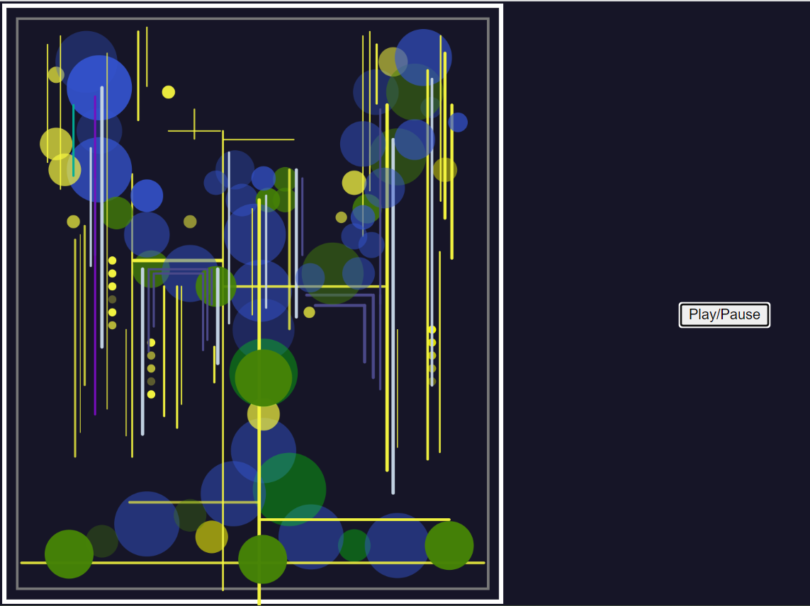

# Yifan-Chang_major

### Description of the interaction with the work
After clicking the play button, the music gets louder and louder. The frequency of vibration of the fruit and vine of the “apple tree” increases, and after about **20** seconds, the music gets louder, the size of the fruit changes drastically, and the vine gets longer and longer.

### Details of a personal approach to animation code
- I am using audio to drive my code.
- The apples and vines in the image will be animated, and as the volume of the music changes, the apples and vines will change to follow the volume. I have modified the original colors to differentiate it from the other team members' work.

### Inspiration
I borrowed the animation effect in the picture *(Figure 1)* and changed the fruit of the “apple tree” by zooming in and out of the circle and linking it to the knowledge points learned in the tutorial. Due to the strong sense of rhythm in the background music, the color of the “apple tree” was changed to a more fantastic and technological color, inspired by the “Tree of Life” in the Avatar movie *(From there [link text](https://www.pinterest.com/pin/597571444325740263/))*. In order to match the rhythm of the “apple”, the change of vines also makes the image more rich and dynamic.

*(figure1)*

### Technical Description
1.In the first code I wanted to animate only the apples in the “Apple Tree”, but due to a technical error I considered the apple tree as a whole and I got a “tree” bouncing to the music *(figure 2)*.

*(figure2)*

2.I get the volume of the audio via `analyser.getLevel()` and put it into the scaling `circleScaleFactor`. The `circleScaleFactor` is then applied to the `update()` method of each circle, dynamically adjusting their radius so that all the circles are scaled in sync with the volume, resulting in an Apple Rhythm effect *(figure 3)*.

*(figure 3)*

3.However, the effect is not satisfactory. I used the same method to make changes to the vines to get the image I wanted, “vines and apples” bouncing together *(Figure 4)*.

*(figure 4)*

4.On the one hand, I was inspired by the “Avanti” tree, and on the other hand, I wanted to differentiate myself from the other members of the group. I changed the color of the tree to get my final result *(Figure 5)*.

*(figure 5)*